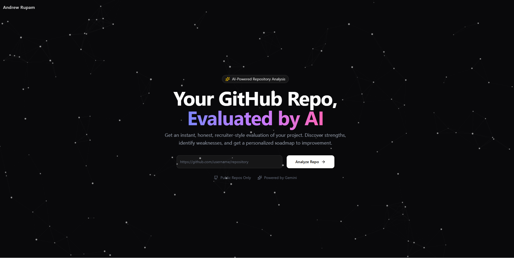

# RepoEvaluator 🚀

An intelligent system that evaluates public GitHub repositories and generates a score, written summary, and personalized improvement roadmap using Google Gemini AI.



## 🎯 Features

- **Real Repository Analysis**  
  Fetches live data using the GitHub API (structure, commits, README, tech stack).

- **AI-Powered Evaluation**  
  Uses Google Gemini to generate recruiter-style feedback.

- **Smart Scoring System**  
  Produces a 0–100 score based on structure, documentation, testing, and maintainability.

- **Personalized Roadmap**  
  Actionable steps tailored to the specific repository.

- **Premium UI Experience**  
  Dark theme, bold typography, smooth animations, and interactive parallax effects.

---

## 🛠️ Tech Stack

- **Framework**: Next.js 14 (App Router)
- **Styling**: Tailwind CSS, Framer Motion
- **AI**: Google Gemini API (`gemini-1.5-flash`)
- **Data**: GitHub REST API (Octokit)
- **Icons**: Lucide React
- **Deployment**: Vercel

---

## 🚀 Getting Started (Local Setup)

### Prerequisites
- Node.js 18+
- Google Gemini API Key
- (Optional but recommended) GitHub Personal Access Token

### Installation

1. Clone the repository
   ```bash
   git clone https://github.com/yourusername/repo-evaluator.git
   cd repo-evaluator
Install dependencies

bash
Copy code
npm install
Set up environment variables

bash
Copy code
cp .env.example .env
Add your keys inside .env:

env
Copy code
GEMINI_API_KEY=your_gemini_api_key
GITHUB_TOKEN=your_github_token
Run the development server

bash
Copy code
npm run dev
Open http://localhost:3000

🔐 Security & Best Practices
API keys are stored only in environment variables.

No secrets are committed to the repository.

All AI analysis runs server-side.

The frontend never directly accesses Gemini or GitHub APIs.

Repository URLs are validated before analysis.

🧱 System Architecture
User Input
User submits a public GitHub repository URL.

Data Fetching
Server fetches repository metadata via GitHub API.

AI Analysis
Structured repo data is sent to Gemini with a specialized evaluation prompt.

Output Rendering
Score, summary, and roadmap are rendered with a responsive UI.

🧪 Demo / Fallback Mode
If API keys are not provided, the app automatically switches to Mock Mode, displaying example outputs for demonstration purposes.

This ensures the project remains usable during demos and reviews.

🎓 Hackathon Relevance
This project prioritizes:

Accuracy over assumptions

Honest feedback over inflated scores

Actionable guidance over generic advice

It evaluates real developer output, not theory.

📄 License
MIT License
